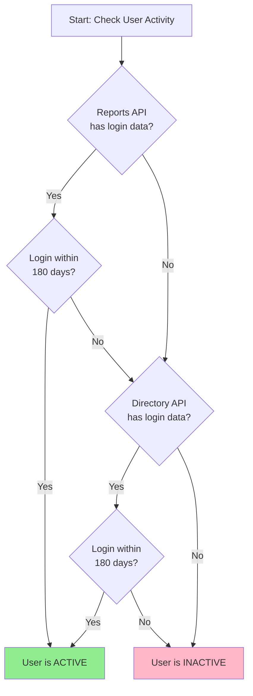

# Google Workspace Inactive Users Audit Script - Technical Documentation

**Script Name:** Inactive Users 180 Days - Auto Run  
**Purpose:** Automated identification of inactive users with expensive licenses  
**Date:** January 2026  
**Author:** Praveen Chowdari M

---

## Executive Summary

This Google Apps Script automates the discovery of Google Workspace users who have not logged in for **180 days** and hold **Enterprise Plus licenses** (or other specified licenses). The script generates detailed reports and can send automated email notifications to stakeholders, enabling proactive license management and cost optimization.

### Key Benefits

- 💰 **Cost Savings**: Identify unused Enterprise Plus licenses (~$18-23/user/month)
- 🔒 **Security**: Detect dormant accounts that pose security risks
- ⚙️ **Automation**: Runs on a schedule without manual intervention
- 📊 **Transparency**: Generates shareable audit reports with complete data
- ✅ **Compliance**: Maintains accurate records of user activity

---

## Problem Statement

Organizations often pay for Google Workspace licenses for users who:
- Have left the company but accounts weren't disabled
- Changed roles and no longer need premium licenses
- Are on extended leave
- Were created for temporary projects

These inactive accounts consume expensive licenses unnecessarily. Manual auditing is time-consuming and error-prone.

---

## Solution Overview

This script provides an **automated, accurate, and efficient** solution by:

1. **Fetching all license assignments** across the organization
2. **Identifying inactive users** using hybrid login detection
3. **Cross-referencing** licenses with inactive accounts
4. **Generating reports** in Google Sheets with actionable data
5. **Sending notifications** to stakeholders automatically

---

## Technical Architecture

### Data Sources

The script uses multiple Google Workspace APIs:

| API | Purpose | Data Provided |
|-----|---------|---------------|
| **Admin Directory API** | User management | User profiles, organizational units, basic login data |
| **Admin Reports API** | Login activity | Accurate, real-time login events (last 180 days) |
| **License Manager API** | License tracking | All license assignments by user |
| **Spreadsheet API** | Report generation | Creates and formats audit reports |
| **Gmail API** | Notifications | Sends email reports to stakeholders |

### Hybrid Login Detection Algorithm

The script uses a **two-tier approach** for maximum accuracy:



**Why Hybrid?**
- **Reports API**: More accurate but only stores 180 days of history
- **Directory API**: Longer history but sometimes outdated or missing
- **Combined**: Provides the most reliable results

---

## Configuration

### Current Settings

```javascript
TARGET_SKU_ID: '1010020020'           // Enterprise Plus license
INACTIVITY_DAYS: 180                   // 6 months threshold
EMAIL_RECIPIENTS: 'email1@example.com, email2@example.com, email3@example.com'
SEND_EMAIL: false                      // Currently disabled
SPREADSHEET_ID: 'YOUR_SPREADSHEET_ID_HERE'
SHARED_DRIVE_FOLDER_ID: '0AA7GGQkHedVoUk9PVA'
```

### Supported License Types

The script can track any Google Workspace license:

- **Enterprise Plus** (1010020020) - Currently configured
- **Enterprise Standard** (1010020028)
- **Business Starter** (1010020027)
- **Business Standard** (1010020028)
- **Business Plus** (1010020025)
- **Cloud Identity Premium** (1010050001)
- And more...

---

## How It Works: Step-by-Step

### Step 1: Fetch License Assignments

**Function:** `getAllLicenseAssignments()`  
**Lines:** 169-212

```
1. Connects to License Manager API
2. Fetches ALL license assignments in batches (1000 at a time)
3. Creates a map: { 'user@domain.com': [licenses] }
4. Includes rate limiting to avoid API quotas
```

**Why This Matters:** Fetching all licenses once is much more efficient than querying each user individually. This prevents hitting Google's API quota limits.

### Step 2: Get Login Activity from Reports API

**Function:** `getLoginActivityFromReports()`  
**Lines:** 220-274

```
1. Queries Reports API for all login events in last 180 days
2. Filters by 'login' event type
3. Tracks most recent login per user
4. Returns map: { 'user@domain.com': 'last_login_timestamp' }
```

**Limitation:** Reports API only stores 180 days of data. For older logins, we fall back to Directory API.

### Step 3: Identify Inactive Users

**Function:** `getInactiveUsers()`  
**Lines:** 280-338

```
1. Fetches all users from Directory API
2. For each user:
   a. Check Reports API data first (most accurate)
   b. If no Reports data, check Directory API lastLoginTime
   c. Compare against 180-day cutoff
3. Returns list of users who haven't logged in for 180+ days
```

**Hybrid Logic:**
- If **either** API shows recent login → User is ACTIVE
- If **both** APIs show old/no login → User is INACTIVE

### Step 4: Match Licenses to Inactive Users

**Main Function:** `auditInactiveEnterpriseUsers()`  
**Lines:** 133-150

```
1. Takes list of inactive users
2. Cross-references with license map
3. Adds license information to each user record
4. Flags users with target license (Enterprise Plus)
```

### Step 5: Generate Report

**Function:** `exportToSheet()`  
**Lines:** 343-401

Creates a Google Sheet with:

| Column | Description |
|--------|-------------|
| Name | User's full name |
| Email | Primary email address |
| OU Path | Organizational unit (department/team) |
| Last Login Time | When they last logged in (or "Never") |
| Creation Time | When account was created |
| Suspended | Whether account is suspended |
| Licenses | All assigned licenses |

**Report Features:**
- ✅ Formatted headers with blue background
- ✅ Frozen header row for easy scrolling
- ✅ Auto-resized columns
- ✅ Timestamped sheet name
- ✅ Saved to Shared Drive for team access

### Step 6: Send Email Notification (Optional)

**Function:** `sendEmailReport()`  
**Lines:** 406-483

Sends HTML-formatted email with:
- Report summary (date, license type, user count)
- Direct link to spreadsheet
- Professional styling with Google colors
- Plain text fallback for email clients

---

## Automation & Scheduling

The script includes three trigger setup options:

### Option 1: Monthly Trigger (Recommended for Production)

**Function:** `setupMonthlyTrigger()`

```javascript
// Runs every 30 days
ScriptApp.newTrigger('auditInactiveEnterpriseUsers')
    .timeBased()
    .everyDays(30)
    .create();
```

**Use Case:** Regular monthly audits for license optimization

### Option 2: Test Trigger (For Validation)

**Function:** `setupTestTrigger()`

```javascript
// Runs every 1 hour for testing
ScriptApp.newTrigger('auditInactiveEnterpriseUsers')
    .timeBased()
    .everyHours(1)
    .create();
```

**Use Case:** Validate automation before production deployment

### Option 3: Custom Trigger

**Function:** `setupEvery4HoursTrigger()`

```javascript
// Runs every 4 hours
ScriptApp.newTrigger('auditInactiveEnterpriseUsers')
    .timeBased()
    .everyHours(4)
    .create();
```

**Use Case:** High-frequency monitoring (not typically recommended)

### Managing Triggers

**Delete All Triggers:**
```javascript
deleteAllAuditTriggers()  // Removes all automation
```

---

## Diagnostic & Debugging Tools

### Check Specific User

**Function:** `debugSpecificUser(userEmail)`  
**Lines:** 531-581

```javascript
debugSpecificUser('john.doe@company.com')
```

**Output:**
- Directory API data (lastLoginTime, creation date, etc.)
- Reports API login events (last 30 days)
- Helps diagnose why a user appears as inactive

### Check API Authorization

**Function:** `checkAuthorizedScopes()`  
**Lines:** 587-646

```javascript
checkAuthorizedScopes()
```

**Validates:**
- ✅ OAuth token is valid
- ✅ Admin Directory API access
- ✅ License Manager API access
- ✅ Reports API access

**Use Case:** Troubleshoot "Not Authorized" errors

---

## Required Permissions (OAuth Scopes)

The script requires these Google Workspace permissions:

```
✅ admin.directory.user.readonly       - Read user information
✅ admin.directory.customer.readonly   - Read organization info
✅ apps.licensing                      - Read license assignments
✅ spreadsheets                        - Create/edit reports
✅ admin.reports.audit.readonly        - Read login activity
✅ script.send_mail                    - Send email notifications
✅ drive                               - Save to Shared Drive
```

**Security Note:** Script must be run by a **Google Workspace Super Admin** to access these APIs.

---

## Prerequisites & Setup

### 1. Enable Required APIs

In Google Apps Script:
1. Click **Services** (+)
2. Add **Admin SDK API**
3. Add **Admin License Manager API**

### 2. Configure Settings

Edit the `CONFIG` object (lines 41-66):

```javascript
TARGET_SKU_ID: '1010020020',           // Change license type if needed
INACTIVITY_DAYS: 180,                   // Adjust threshold
EMAIL_RECIPIENTS: 'your-email@domain.com',
SEND_EMAIL: true,                       // Enable notifications
SHARED_DRIVE_FOLDER_ID: 'your-folder-id'
```

### 3. First Run Authorization

1. Run `auditInactiveEnterpriseUsers()` manually
2. Click **Review Permissions**
3. Select your Super Admin account
4. Click **Allow**

### 4. Set Up Automation

```javascript
setupMonthlyTrigger()  // For production
// OR
setupTestTrigger()     // For testing first
```

---

## Sample Output

### Console Log Example

```
Auditing users inactive since: 2025-07-09T12:04:34.000Z
Fetched Canonical Customer ID: C01234567
Fetching all license assignments for SKU: 1010020020...
Found 1,247 users with licenses.
Fetching login activity from Reports API...
Reports API: Found 45,892 login activities for 1,189 unique users
Found 58 inactive users.
Found 12 users with Target License and Inactive.
Report generated: https://docs.google.com/spreadsheets/d/ABC123...
Email sent successfully to: admin@company.com
```

### Spreadsheet Report Example

| Name | Email | OU Path | Last Login Time | Creation Time | Suspended | Licenses |
|------|-------|---------|-----------------|---------------|-----------|----------|
| John Doe | john.doe@company.com | /Sales | 2025-01-15T10:30:00Z | 2020-03-01T08:00:00Z | false | Enterprise Plus |
| Jane Smith | jane.smith@company.com | /Marketing | Never | 2024-11-20T14:22:00Z | false | Enterprise Plus, Google Vault |

---

## Performance & Scalability

### API Quota Considerations

| API | Daily Quota | Script Usage |
|-----|-------------|--------------|
| Admin Directory | 150,000 requests | ~1-5 requests per run |
| License Manager | 1,000 requests | ~1-10 requests per run |
| Reports API | 10,000 requests | ~5-50 requests per run |

**Optimization Strategies:**
- ✅ Batch fetching (1000 records per request)
- ✅ Rate limiting delays (100-200ms between requests)
- ✅ Single license fetch instead of per-user queries

### Execution Time

| Organization Size | Estimated Runtime |
|-------------------|-------------------|
| 100 users | 30-60 seconds |
| 1,000 users | 2-5 minutes |
| 10,000 users | 10-20 minutes |
| 50,000+ users | 30-60 minutes |

**Note:** Google Apps Script has a 6-minute execution limit for triggers, 30-minute limit for manual runs.

---

## Cost Impact Analysis

### Example Scenario

**Organization:** 1,000 users  
**Enterprise Plus License Cost:** $20/user/month  
**Inactive Users Found:** 25 users

**Monthly Savings:** 25 × $20 = **$500/month**  
**Annual Savings:** **$6,000/year**

### ROI Calculation

**Script Development Time:** 8 hours  
**Monthly Maintenance:** 30 minutes  
**Payback Period:** < 1 month

---

## Troubleshooting Guide

### Common Issues

#### 1. "Not Authorized to access this resource/api"

**Solution:**
1. Run `checkAuthorizedScopes()` to identify which API failed
2. Enable Admin SDK API in Apps Script Services
3. Remove old authorization at myaccount.google.com/permissions
4. Re-authorize the script

#### 2. "Service not found: AdminReports"

**Solution:**
1. Click **Services** (+) in Apps Script editor
2. Add **Admin SDK API**
3. Save and re-run

#### 3. Active users showing as inactive

**Solution:**
1. Run `debugSpecificUser('user@domain.com')`
2. Check if Reports API has recent login data
3. Verify user actually logged in (not just mobile sync)

#### 4. Email not sending

**Solution:**
1. Set `SEND_EMAIL: true` in CONFIG
2. Add valid email addresses to `EMAIL_RECIPIENTS`
3. Check script has `script.send_mail` scope

---

## Security Considerations

### Data Privacy

- ✅ Script only reads data, never modifies user accounts
- ✅ Reports stored in Shared Drive with controlled access
- ✅ Email notifications sent to authorized recipients only
- ✅ No external API calls or third-party services

### Access Control

- ⚠️ Must be run by Super Admin (required for API access)
- ✅ Audit logs available in Google Workspace Admin Console
- ✅ All script executions logged with timestamps

### Compliance

- ✅ GDPR-compliant (read-only access to necessary data)
- ✅ Audit trail maintained in execution logs
- ✅ Data stored within Google Workspace ecosystem

---

## Future Enhancements

### Potential Improvements

1. **Multi-License Tracking**: Audit multiple license types in one run
2. **Trend Analysis**: Track inactive user counts over time
3. **Automated Actions**: Auto-suspend or downgrade licenses
4. **Dashboard Integration**: Real-time visualization of license usage
5. **Slack/Teams Notifications**: Alternative to email alerts
6. **Custom Thresholds**: Different inactivity periods per OU

---

## Maintenance & Support

### Regular Maintenance Tasks

- [ ] **Monthly**: Review generated reports
- [ ] **Quarterly**: Verify trigger is running successfully
- [ ] **Annually**: Update license SKU IDs if Google changes them
- [ ] **As Needed**: Adjust inactivity threshold based on policy

### Monitoring

Check **Apps Script Executions** tab for:
- ✅ Successful runs
- ⚠️ Failed executions
- 📊 Execution duration
- 📧 Email delivery status

---

## Contact & Documentation

**Script Maintainer:** Praveen Chowdari M  
**Documentation:** This file  
**Script Location:** `c:\Users\Praveen Chowdari M\Documents\My Git\AppScript\Inactive users\`

**External Resources:**
- [Google Workspace Admin SDK](https://developers.google.com/admin-sdk)
- [License Manager API](https://developers.google.com/workspace/admin/licensing)
- [Apps Script Documentation](https://developers.google.com/apps-script)

---

## Conclusion

This script provides a **robust, automated, and cost-effective** solution for managing Google Workspace licenses. By identifying inactive users with expensive licenses, it enables:

- 💰 Significant cost savings
- 🔒 Improved security posture
- ⚙️ Reduced administrative overhead
- 📊 Data-driven decision making

The hybrid login detection approach ensures accuracy, while the automated scheduling eliminates manual work. With proper configuration and monitoring, this script can save thousands of dollars annually while maintaining compliance and security standards.

---

**Document Version:** 1.0  
**Last Updated:** January 6, 2026  
**Status:** Production Ready
